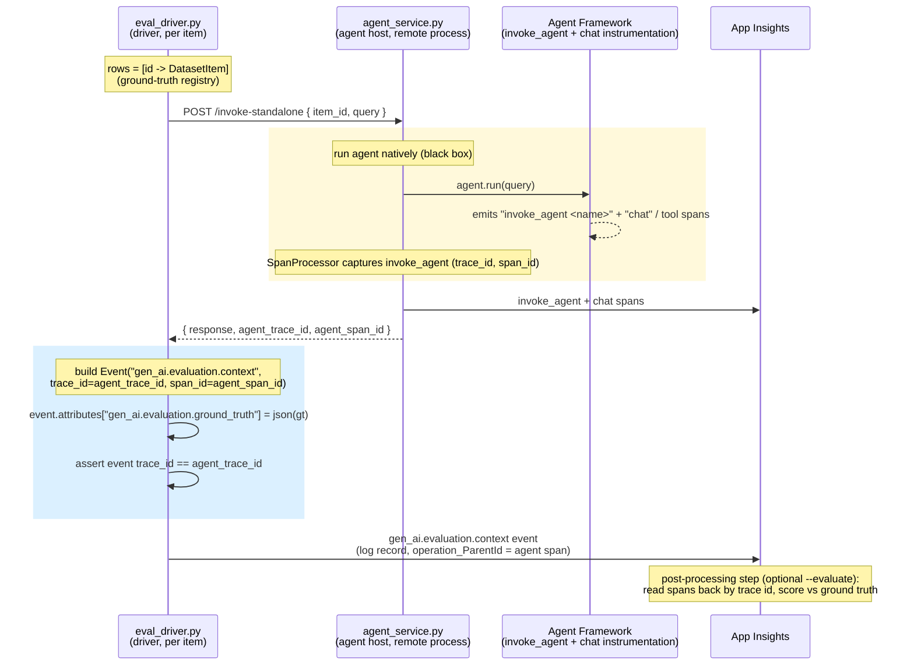

# cross-process-eval-context-poc

A proof-of-concept that attaches a **ground-truth object** to an agent's trace
**from a separate process**, **without any tracing code in the agent**.

How it works: the agent runs as a **black box** and authors its own
`invoke_agent` span natively; the agent host returns that span's
`(trace_id, span_id)`; a separate **evaluation driver** then emits a
`gen_ai.evaluation.context` OTel event stamped with those ids, carrying the
ground truth. The event lands as a log record correlated to the agent's
`invoke_agent` span (`operation_ParentId` == the agent span id) in the same
trace.

Net result: the agent's real `invoke_agent → chat` spans stay exactly as the
framework produced them — nothing is mutated and no child span is fabricated —
and the ground truth is added afterward as a correlated event in the same trace,
attached across a process boundary.

## Adopt this with your own agent (BYO agent)

You do **not** need to understand or touch any tracing internals
(`invoke_agent`, `gen_ai.evaluation.context` events, span processors, telemetry
setup). Treat the agent as a **black box**. The host invokes it and returns the
ids; the driver emits the ground-truth event.

**The only file you edit is [`src/span_two_process_eval_poc/agent.py`](src/span_two_process_eval_poc/agent.py).**
Replace the body of `build_agent()` so it returns *your* agent. Everything else
stays exactly as shipped.

### Step 1 — plug in your agent

`build_agent()` must return an object with an **async `run(query: str)` method**
that returns the agent's answer (any object; it is stringified). That is the
only contract on the agent itself.

```python
# src/span_two_process_eval_poc/agent.py
def build_agent():
    # Build and return YOUR agent however you normally do.
    # No tracing, no spans, no OpenTelemetry — just your agent.
    return MyAgent(...)          # must expose:  async def run(self, query: str)
```

If your agent already uses the Microsoft Agent Framework, you can keep the
shipped implementation and only change the model/instructions. If it is a
LangChain / custom / HTTP agent, wrap it in a tiny class:

```python
class MyAgentAdapter:
    def __init__(self, my_agent):
        self._agent = my_agent
    async def run(self, query: str) -> str:
        return await self._agent.ainvoke(query)   # adapt to your API
```

### Step 2 — configure `.env`

```
cp .env.example .env
```

Fill in your model endpoint / deployment and your **Application Insights
connection string** (where traces are sent). Nothing here is about tracing
mechanics — just credentials and the destination.

### Step 3 — run it (two processes)

```bash
uv sync

# 1. start the agent host (wraps your build_agent())
uv run uvicorn span_two_process_eval_poc.agent_service:app --port 8002

# 2. in another terminal, run the driver over your dataset
uv run run-poc --dataset data/dataset.jsonl
```

Put your `query` / `ground_truth` pairs in `data/dataset.jsonl` (one JSON object
per line; `ground_truth` can be a string or a structured object).

### That's it

The driver prints an `operation_Id` per row and a ready-to-paste KQL query. Open
App Insights → Logs, paste it, and you'll see each trace with your ground truth
correlated to the agent's `invoke_agent` span.

> **What you do NOT touch:** `agent_service.py`, `eval_driver.py`,
> `trace_context.py`, and `telemetry.py` are the harness. They are shipped as-is
> and require no changes. The agent is a black box behind `build_agent()`.

## The contract between Agent and eval driver

The agent needs no tracing code. The only requirement is on the agent **host**:
every invocation must **return the ids of the span the agent authored**, so the
driver knows what to correlate the ground truth to.

| Field | Meaning |
|---|---|
| `agent_trace_id` | 128-bit trace id, 32 lowercase hex chars |
| `agent_span_id`  | 64-bit span id, 16 lowercase hex chars |

In this POC the host (`agent_service.py`) obtains those ids with a passive
`SpanProcessor` that observes the framework's `invoke_agent` span and returns
them from `/invoke-standalone`. Any host that returns these two ids for an
invocation can plug into the evaluation driver; how it obtains them is its own
concern. **It does not matter who calls the agent** — any process that receives
these ids can emit the ground-truth event afterward.

## Why this design

| Concern | This POC |
|---|---|
| Processes | **Two** (agent-service + evaluation driver) |
| Agent location | **Remote HTTP service** |
| Ground truth carried by | A `gen_ai.evaluation.context` event correlated to the agent's `invoke_agent` span (JSON **attribute**) |
| Agent code changes | **None** — the agent runs natively; the host returns the span ids; the driver emits the event afterward |

The agent authors its own `invoke_agent` span natively (with `chat`/tool spans
beneath it). The driver emits a `gen_ai.evaluation.context` event stamped with
that span's `(trace_id, span_id)`, so it lands as a log record correlated to the
agent's `invoke_agent` span in the **same trace** — the whole invocation (agent
work plus ground truth) lives in one coherent trace, without the agent knowing
anything about evaluation and without mutating any span.

## Requirements

The design must satisfy all of the following. Each is a hard requirement, not a
nice-to-have.

1. **Ground truth correlated to the exact agent span.** The ground-truth object
   must correlate to **the** `invoke_agent` span for the row, identified by its
   `span_id`, as an event in the same trace (`operation_ParentId` == that
   `span_id`).
2. **Separate agent process.** The agent runs as a **separate HTTP service**
   from the driver that attaches the ground truth (both alive concurrently).
3. **No agent-process code changes.** The agent runs as a black box behind
   `build_agent()` with **zero** tracing code. The only integration requirement
   is on the host: it must return the agent span's `(trace_id, span_id)`.
4. **Attach a ground-truth object only.** Carry a structured ground-truth object
   (not a bare string) on the event. **No scores or results** are attached here
   — only evaluation *input*.
5. **Cheap, unambiguous backend query.** Correlation must be resolvable in App
   Insights with a simple, first-class join (no fragile string/JSON parsing).

## How it works



Resulting spans + event (one `trace_id`):

```
invoke_agent <name>                  (agent-service, framework's own span, span_id=A)
│  └─ chat / tool spans              (agent framework)
└─ gen_ai.evaluation.context          (driver, log record; operation_ParentId=A)
      • attribute: gen_ai.evaluation.ground_truth = {...}   ← ground truth here
```

The **agent process is never involved in correlation** — the agent runs
natively and Agent Framework emits its own `invoke_agent → chat` spans. The host
captures the `invoke_agent` span's `(trace_id, span_id)` with a passive
`SpanProcessor` and returns them; the driver then emits an event stamped with
those ids, carrying the ground truth. No span is mutated and none is fabricated
above the agent's own root.

> **Evaluation is a separate post-processing step.** By default the driver only
> *attaches ground-truth input* to the agent's trace. Scoring the responses
> against that ground truth is an opt-in step (`--evaluate`, or
> `RUN_EVALUATION=1`) that runs after all invocations complete: it reads the
> traces back from App Insights by trace id and runs built-in evaluators
> (`evaluation.py`).

## Layout

```
data/dataset.jsonl                         # query + ground_truth rows
src/span_two_process_eval_poc/
  dataset.py                               # JSONL loader
  telemetry.py                             # Azure Monitor setup (both processes)
  trace_context.py                         # shared span/attribute name constants
  agent.py                                 # Foundry agent builder (no POC-specific code)
  agent_service.py                         # FastAPI /invoke-standalone — runs agent natively, returns its span ids
  eval_driver.py                           # DRIVER: calls the agent, emits gen_ai.evaluation.context event + ground truth
  evaluation.py                            # optional --evaluate post-processing (trace-id scoring)
```

## Prerequisites

- Python 3.10+
- [uv](https://docs.astral.sh/uv/)
- A Microsoft Foundry project with a model deployment
- An Application Insights resource (connection string)
- `az login`

## Setup

```bash
cp .env.example .env   # fill in the values
uv sync
```

## Run (two processes)

Terminal 1 — the agent-service (the agent host):

```bash
uv run uvicorn span_two_process_eval_poc.agent_service:app --port 8002
```

Terminal 2 — the evaluation driver:

```bash
uv run run-poc
# or: uv run run-poc --dataset path/to/other.jsonl \
#       --agent-service-url http://localhost:8002/invoke-standalone
# add --evaluate (or set RUN_EVALUATION=1) to run the scoring post-processing step
```

The driver prints, per row, the agent's `invoke_agent` `trace_id`/`span_id`
(= `operation_Id`), confirms the emitted `gen_ai.evaluation.context` event is
stamped into the **same trace**, and at the end prints an `operation_Id` summary
plus a ready-to-paste App Insights KQL query.

## Verify in App Insights (KQL)

The ground truth is a JSON **attribute on the `gen_ai.evaluation.context`
event**, which lands in the `traces` table as a log record correlated to the
agent's `invoke_agent` span via `operation_ParentId` (same `operation_Id`):

```kql
traces
| where customDimensions["event.name"] == "gen_ai.evaluation.context"
| project timestamp, operation_Id,
          parent_invoke_agent = operation_ParentId,
          ground_truth = tostring(customDimensions["gen_ai.evaluation.ground_truth"])
// The parent invoke_agent span (agent's own):
//   dependencies | where name startswith "invoke_agent"
//   | where id == <event operation_ParentId>
```

To see every span from a specific run, filter by the `operation_Id`s the driver
prints (== the OTel `trace_id`s):

```kql
union traces, dependencies, requests, exceptions
| where operation_Id in ("<op_id_1>", "<op_id_2>", ...)
| project timestamp, itemType, name, operation_Id, operation_ParentId,
          ground_truth = tostring(customDimensions["gen_ai.evaluation.ground_truth"])
| order by timestamp asc
```

## Notes / trade-offs

- **It does not matter who calls the agent.** This is the whole point of the
  attach-after model. The agent runs as a pure **black box**: it establishes its
  own trace natively (`invoke_agent → chat`), knows nothing about evaluation, and
  needs **zero** tracing code. The *only* contract between the agent and the
  harness is that the invocation **returns the agent's `trace_id` + `span_id`**.
  Any process — this driver, a notebook, a CI job, some other service — that
  receives those two ids can emit the ground-truth event afterward. There is no
  requirement that the evaluation harness be the caller, and no context has to be
  set up *before* the agent runs; the ids flow **outward** from the agent and
  the event is emitted **after the fact**.
- **The agent code is not changed — the _host_ surfaces the ids.** This is the
  distinction that matters. The agent (`build_agent()`) is invoked as a plain
  black box (`await _agent.run(query)`): no tracing calls, no returning ids,
  nothing added to it. The logic that learns the agent's `invoke_agent` span id
  lives entirely in the **host** (`agent_service.py`), not the agent:
  - `_InvokeAgentSpanCapture` is an OTel `SpanProcessor` registered on the
    tracer provider via `provider.add_span_processor(...)`. Its `on_start` hook
    fires for **every** span the moment it is created — including the framework's
    internal `invoke_agent` span, which the endpoint code never gets a handle to
    otherwise (it is created, entered, and ended inside `AgentTelemetryLayer`).
    We stash that span's `(trace_id, span_id)` in a per-request `ContextVar` and
    return it after `_agent.run()` completes.
  - So the boundary is: **agent code = zero changes; host code = one small,
    passive hook.** The processor never touches the agent object or its code
    path — it only observes spans at the SDK level.
  - In this POC the agent and host share one in-process tracer provider, so the
    SpanProcessor trick works. For a real **out-of-process** BYO agent, the
    equivalent is the agent's *runtime/host* returning the ids in the response
    (body, HTTP header, message field). Either way the requirement lands on the
    **host/runtime**, never on the agent author's logic. The `SpanProcessor` here
    is simply the in-process stand-in for "the host returns the span ids."
- The ground-truth object is set **directly as a JSON attribute**
  (`gen_ai.evaluation.ground_truth`) on the driver's span, which is attached as a
  child of the agent's real `invoke_agent` span (same `trace_id`, cross-process).
  OTel attribute values must be primitives, so the structured object travels as a
  JSON string.
- Evaluation/scoring is **not** performed here — only ground-truth *input* is
  attached. Scoring is a separate **post-processing** step run after all agent
  invocations complete (read the spans back from App Insights and compute
  metrics).
