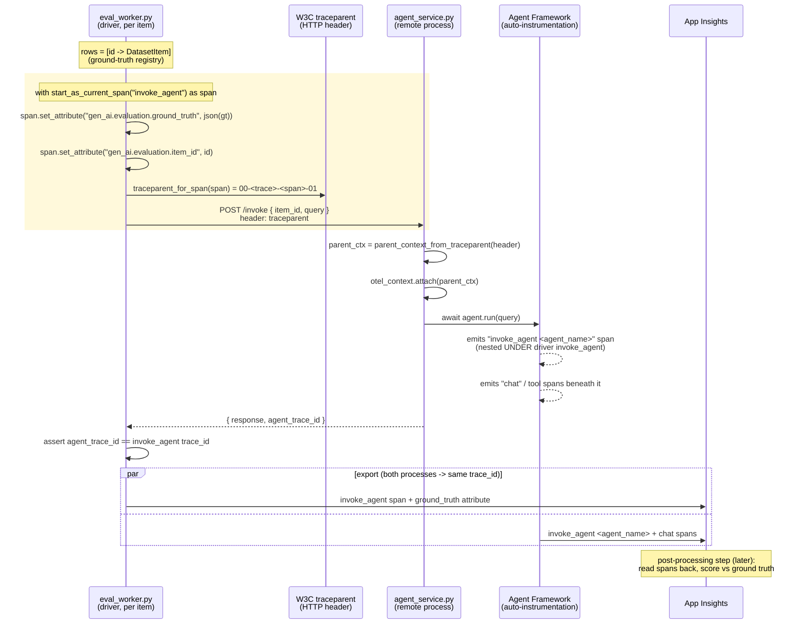

# span-two-process-eval-poc

A proof-of-concept that attaches a **ground-truth object** directly to an
**`invoke_agent` span** — with the agent running as a **separate process** —
**without any tracing code in the agent process**. It mirrors the **ACA
topology** (Yingying's design): the driver authors `invoke_agent`, calls a
*remote* agent service, and stamps the ground truth onto that span.

It combines two ideas:

- **[`trace-ground-truth-poc`](https://github.com/singankit/trace-ground-truth-poc)**
  (Ankit): attach the ground-truth object to the `invoke_agent` span. This POC
  attaches it as a **JSON attribute** (`gen_ai.evaluation.ground_truth`) on that
  span.
- **Remote-agent reality (ACA-faithful)**: the **eval-worker** (the driver)
  **authors** the `invoke_agent` span and calls the agent as a **separate HTTP
  service**, injecting a W3C `traceparent` header. The agent is a *passive
  header recipient* — its own framework instrumentation emits an
  `invoke_agent <agent_name>` span nested under the driver's `invoke_agent`, and
  it needs **no** tracing code of its own.

Net result: the ground-truth object lands **directly on the `invoke_agent`
span** authored by the driver, and the remote agent's framework spans nest
underneath it in the same trace.

## Why this design

| Concern | `trace-ground-truth-poc` | this POC |
|---|---|---|
| Processes | Single | **Two** (agent-service + eval-worker/driver) |
| Agent location | In-process | **Remote HTTP service** |
| Ground truth attached to | The `invoke_agent` span | The `invoke_agent` span (JSON **attribute**) |
| Agent code changes | n/a (single process) | **None** — the driver authors `invoke_agent` and injects `traceparent`; the remote agent just receives the header |

The `invoke_agent` span is authored by the driver and carries the ground truth.
The remote agent's framework `invoke_agent <agent_name>` span nests under it
(via the propagated `traceparent`), so the whole invocation — request, agent
work, and ground truth — lives in one coherent span subtree.

## Requirements

The design must satisfy all of the following. Each is a hard requirement, not a
nice-to-have.

1. **Ground truth on the exact `invoke_agent` span.** The ground-truth object
   must be attached to **the** `invoke_agent` span for the row, identified by its
   `span_id`.
2. **Separate agent process.** The agent runs as a **separate HTTP service**
   from the driver that authors the `invoke_agent` span (both alive
   concurrently).
3. **No agent-process code changes.** The agent/target process must require
   **zero** tracing code — the driver authors `invoke_agent` and injects a
   `traceparent` header; the remote agent's own framework instrumentation emits
   `invoke_agent <agent_name>` beneath it. Only the driver is ours to instrument.
4. **Attach a ground-truth object only.** Carry a structured ground-truth object
   (not a bare string). **No scores or results** are attached here — only
   evaluation *input*.
5. **Cheap, unambiguous backend query.** Correlation must be resolvable in App
   Insights with a simple, first-class join (no fragile string/JSON parsing).

## How it works



Resulting span tree (one `trace_id`):

```
invoke_agent                         (eval-worker/driver authors, span_id=A)
│  • attribute: gen_ai.evaluation.ground_truth = {...}   ← ground truth here
│  • attribute: gen_ai.evaluation.item_id = "<id>"
└─ invoke_agent <agent_name>         (agent-service, framework auto-span)
    └─ chat / tool spans             (agent framework)
```

The **agent process is never involved in correlation** — the *driver* authors
the `invoke_agent` span, injects its `traceparent` into the remote agent call,
and sets the ground truth as an attribute on that same span. The agent is a
plain Agent Framework app: its own instrumentation emits an
`invoke_agent <agent_name>` span that nests under the driver's `invoke_agent`.
This matches ACA (`target_util.invoke_agent_with_tracing`), where nested
`invoke_agent` spans are expected and reconciled downstream by the trace
consumer's parent-chain dedup — **no** agent-side tracing code is required.

> **Evaluation is a separate post-processing step.** The driver only *attaches
> ground-truth input* to the `invoke_agent` span. Scoring the agent's responses
> against this ground truth happens **later, after all agent invocations
> complete** — e.g. a batch job that reads these spans back from App Insights and
> computes metrics. That step is intentionally out of scope here.

## Layout

```
data/dataset.jsonl                         # query + ground_truth rows
src/span_two_process_eval_poc/
  dataset.py                               # JSONL loader
  telemetry.py                             # Azure Monitor setup (both processes)
  trace_context.py                         # build/parse traceparent (the core)
  agent.py                                 # Foundry agent builder (no POC-specific code)
  agent_service.py                         # FastAPI /invoke — remote agent; framework emits invoke_agent <name>
  eval_worker.py                           # DRIVER: authors invoke_agent, calls agent, stamps ground truth
```

## Prerequisites

- Python 3.10+
- [uv](https://docs.astral.sh/uv/)
- A Microsoft Foundry project with a model deployment
- An Application Insights resource (connection string)
- `az login`

## Setup

```bash
cp .env.example .env   # fill in the values
uv sync
```

## Run (two processes)

Terminal 1 — the agent-service (the remote agent):

```bash
uv run uvicorn span_two_process_eval_poc.agent_service:app --port 8002
```

Terminal 2 — the eval-worker (the driver loop):

```bash
uv run run-poc
# or: uv run run-poc --dataset path/to/other.jsonl \
#       --agent-service-url http://localhost:8002/invoke
```

The eval-worker prints, per row, the `invoke_agent` `trace_id`/`span_id`
(= `operation_Id`), confirms the remote agent ran under the **same trace**
(`agent_trace_id`), and at the end prints an `operation_Id` summary plus a
ready-to-paste App Insights KQL query.

## Verify in App Insights (KQL)

The ground truth is a JSON **attribute on the `invoke_agent` span itself**, so no
join is needed — query the span directly. The remote agent's framework
`invoke_agent <agent_name>` span nests under it via `operation_ParentId`:

```kql
dependencies
| where name == "invoke_agent"
| project timestamp, operation_Id,
          invoke_agent_span = id,
          ground_truth = tostring(customDimensions["gen_ai.evaluation.ground_truth"])
// The remote agent's framework span nests under invoke_agent:
//   dependencies | where name startswith "invoke_agent"
//   | where operation_ParentId == <invoke_agent id>
```

To see every span from a specific run, filter by the `operation_Id`s the driver
prints (== the OTel `trace_id`s):

```kql
union traces, dependencies, requests, exceptions
| where operation_Id in ("<op_id_1>", "<op_id_2>", ...)
| project timestamp, itemType, name, operation_Id, operation_ParentId,
          ground_truth = tostring(customDimensions["gen_ai.evaluation.ground_truth"])
| order by timestamp asc
```

## Notes / trade-offs

- The ground-truth object is set **directly as a JSON attribute**
  (`gen_ai.evaluation.ground_truth`) on the `invoke_agent` span the driver
  authors — there is no separate eval/child span. OTel attribute values must be
  primitives, so the structured object travels as a JSON string.
- The driver **authors** the `invoke_agent` span; the agent is a **remote
  service** whose framework instrumentation emits `invoke_agent <agent_name>`
  beneath it via the propagated `traceparent` header. Two nested `invoke_agent`
  spans is the expected ACA shape (`target_util.invoke_agent_with_tracing`): the
  outer driver span carries the ground truth, the inner framework span carries
  the agent payload, and the trace consumer reconciles them via parent-chain
  dedup. Stamping ground truth on the driver's span is authoritative — the agent
  needs no tracing code.
- Evaluation/scoring is **not** performed here — only ground-truth *input* is
  attached. Scoring is a separate **post-processing** step run after all agent
  invocations complete (read the spans back from App Insights and compute
  metrics).
- If you also want the agent's *internal* spans in the same trace, enable OTel
  auto-instrumentation on the agent via **config** (still no source changes).
